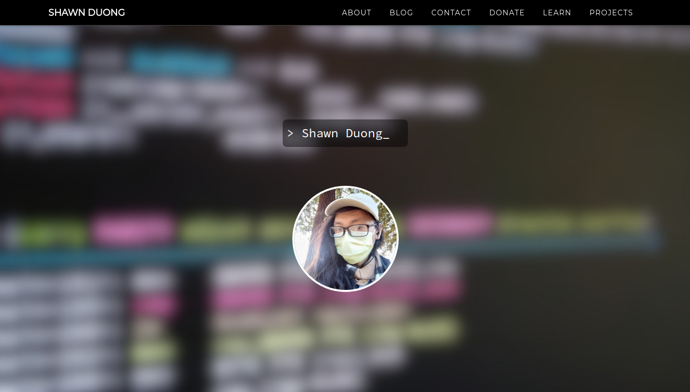
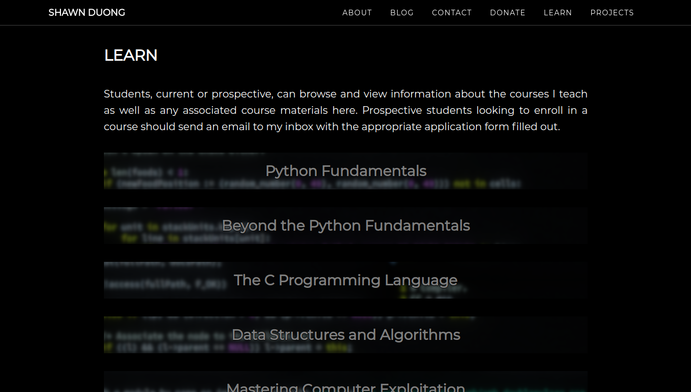
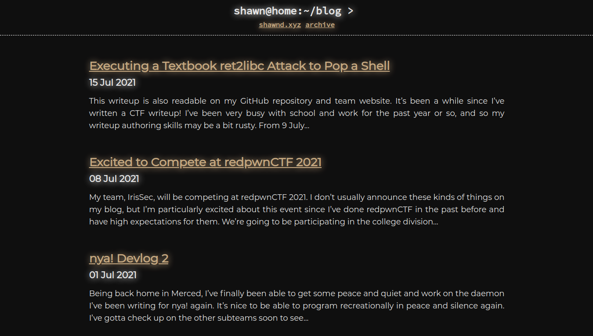
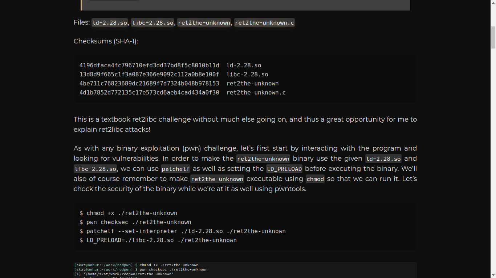

# hello.xyz

hello.xyz is a lightweight, fast, and minimalistic personal website Jekyll theme fit for portfolios, blogs, and more.

This Jekyll theme was created for my own personal website and this repository's code is adapted from my website's code.

## Contents

- [Theme Demo](#theme-demo)
- [Installation](#installation)
- [Setup](#setup)
- [Usage](#usage)
- [License](#license)

## Theme Demo

For a full, live demo, you can visit my personal website that uses this theme: [Demo](https://shawnd.xyz/).

**Main Page**



**About Page**


**Learn Page**



**Blog**



**Blog Post**



## Installation

To install this repository, you may either self-host or use GitHub pages for hosting.

**To self-host,** first clone the repository:

```
$ git clone https://github.com/shawnduong/hello.xyz
```

Then, `cd` into the cloned repository and install the required gems:

```
$ cd ./hello.xyz/
$ bundle install
```

**To use GitHub pages,** simply fork the repository by clicking the "Fork" button at the top-right of the page and enable GitHub pages hosting in the forked repository's settings.

## Setup

1. Fill in the basic information and contact information in `_config.yml`.
2. Go to `_layouts/index.html` and replace the sample quotes in the JavaScript with your own quotes.
3. Replace the sample text in `about.md`, `contact.md`, `donate.md`, `index.md`, `learn.md`, and `projects.md` with your own text.

## Usage

To preview your website locally, you can serve the website with Jekyll:

```
$ jekyll serve
```

If you would like to create a complete build of your website, you can build the website with Jekyll:

```
$ jekyll build
```

In either case, `_site/` is the root directory of the built website. If you're not using GitHub pages and are instead self-hosting, then the path to `_site/` is where you want to set the website root directory from your web server's configuration file.

You can write courses in `_learn`, projects in `_projects`, and blog posts in `_posts`.

## License

This theme is published under the MIT license. You may find a copy of the license here: [LICENSE](./LICENSE)
